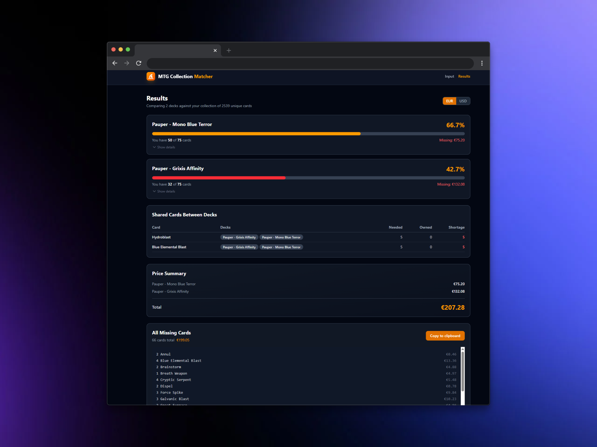

# 🧙‍♂️ MTG Deck Matcher & Collection Tool

A powerful tool for Magic: The Gathering players to bridge the gap between their collection and their next deck. Compare your library against multiple decklists simultaneously, identify shared staples, and calculate the exact cost to finish your builds using real-time Scryfall data.


<div align="center">
  
</div>

---

## ✨ Key Features

* **Multi-Deck Comparison**: Analyze your collection against several decks at once to see your progress across multiple projects.
* **Moxfield Integration**: Support for pasting raw text or uploading CSV exports directly from Moxfield.
* **Gap Analysis**: Get a detailed breakdown of missing cards, including completion percentages and total deck costs.
* **Smart Shopping List**: Automatically generates a consolidated list of all missing cards across all compared decks, ready to copy-paste into marketplaces.
* **Scryfall Powered**: Real-time pricing (USD/EUR) and high-quality card imagery fetched directly from the Scryfall API.
* **100% Client-Side**: Your data never leaves your browser. No databases, no tracking, and no account required.

---

## 🚀 How to Use

1.  **Import Your Collection**: 
    * Go to your collection manager (e.g., Moxfield).
    * Export your list as **Text** or **CSV**.
    * Paste the content into the **"Collection"** area of the app.
2.  **Add Target Decks**:
    * Paste the decklists you are planning to build. 
    * You can add multiple decks to see how your collection covers them simultaneously.
3.  **Run Comparison**:
    * Click the **"Compare"** button. The app will parse the lists and match them against your library.
4.  **Analyze Results**:
    * Check the **Results Page** to see your completion percentage for each deck.
    * Use the **"Shared Cards"** section to see which staples are used across multiple decks.
    * Copy the **"Combined Missing List"** to quickly buy the cards you need.

---

## 🛠️ Tech Stack

* **Frontend Framework**: React 18 with Vite.
* **Language**: TypeScript for robust data handling.
* **Styling**: Tailwind CSS for a modern, responsive dark-mode UI.
* **Testing**: **Playwright** for end-to-end (E2E) testing and UI validation.
* **API**: [Scryfall API](https://scryfall.com/docs/api) for live card data and pricing.
* **State Management**: React Context API for cross-page data persistence.

---

## 📦 Local Setup

To run this project locally, follow these steps:

1.  **Clone the repository**:
    ```bash
    git clone git@github.com:em-jose/mtg-collection-matcher.git
    ```
2.  **Install dependencies**:
    ```bash
    npm install
    ```
3.  **Start the development server**:
    ```bash
    npm run dev
    ```
4.  **Run Tests**:
    ```bash
    # Run unit tests
    npm run test

    # Run watch unit test
    npm run test:watch

    # Run E2E tests
    npm run test:e2e
    
    # Run all tests
    npm run test:all
    ```
5.  **Build for production**:
    ```bash
    npm run build
    ```

---

## ⚖️ Legal Disclaimer

**MTG Deck Matcher** is unofficial Fan Content permitted under the Fan Content Policy. Portions of the materials used are property of Wizards of the Coast. ©Wizards of the Coast LLC.

Pricing, card data, and imagery are provided by **Scryfall**. This project is not affiliated with Wizards of the Coast or Scryfall.

---